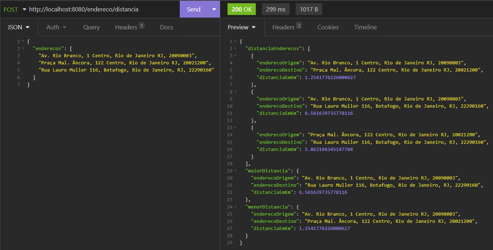

# desafio
Projeto desenvolvido para desafio de processo de seleção. API REST utilizando Java 11 e Spring Boot que deve receber lista de endereços e devolver lista com distância entre eles e par dos endereços mais próximos e mais distantes.

```bash
# Clone este repositório
$ git clone https://github.com/azevedolh/desafio.git
```

 

## Funções
### Listar Distancias:
- URL: http://localhost:8080/endereco/distancia
- Method: POST
- Body:
```json
{
	"enderecos": [
		"String",
		"String",
		"String"
	]
}
```

### Swagger
- URL: http://localhost:8080/swagger-ui/index.html

##

### Contato

[](https://www.linkedin.com/in/luan-azevedo-8a446739/)